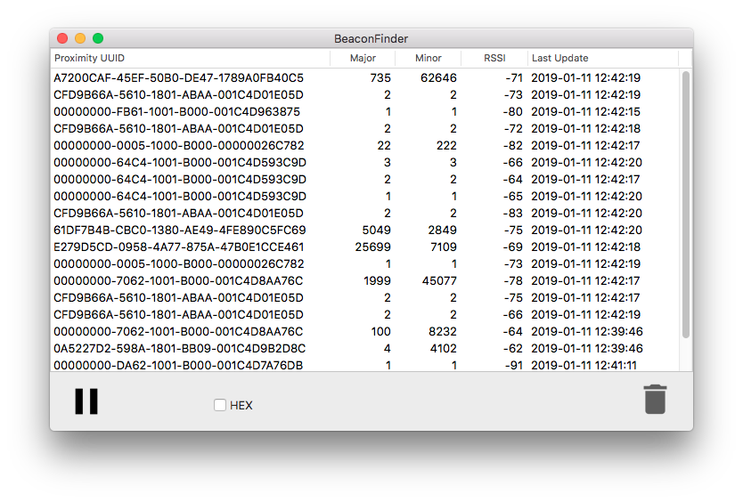
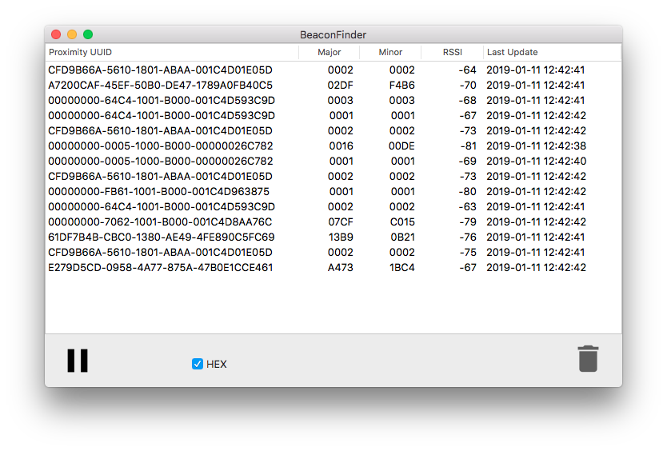

# BeaconFinder
GUI tool for detecting beacons.

### Features

* HEX format display of major and minor
* Device-based rather than UUID-based
  That is, when the UUID of a device changes, instead of adding a row, it rewrites the UUID of that row.
* Copy a selected UUID to the pasteboard.

### Screenshots

